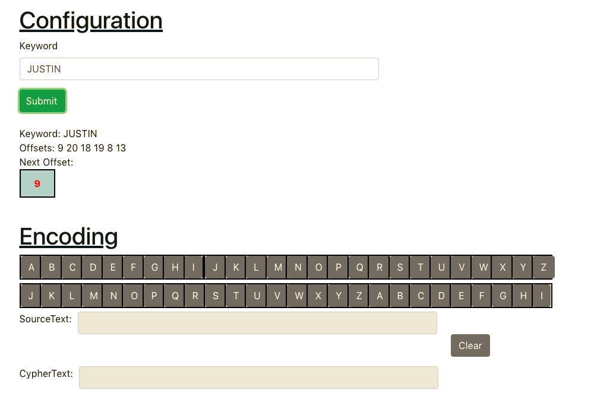
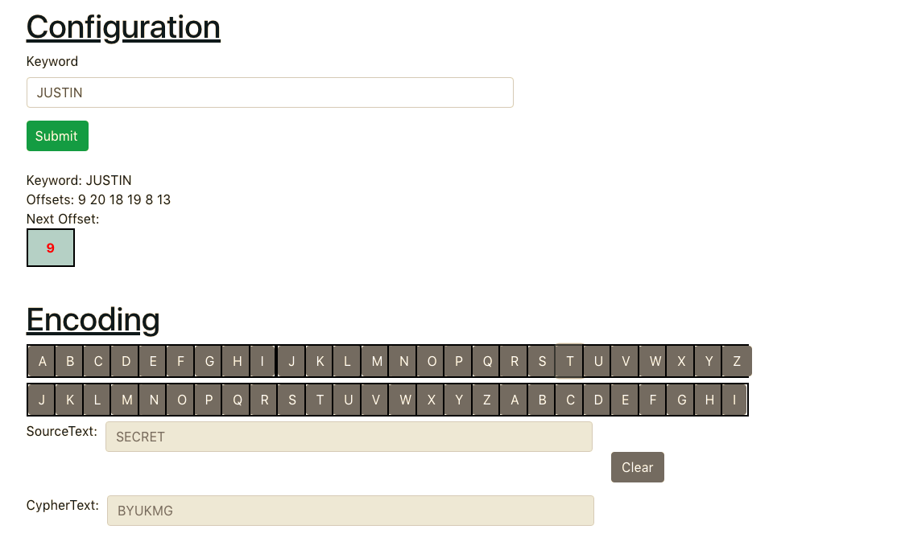

This project was bootstrapped with [Create React App](https://github.com/facebook/create-react-app).
# CaeserCipher
## By Justin Xie

## How it was built
1. Used ReactJS
2. Comprises of three main components
  * Main App Component with input fields
  * Individual Letter Components

## How it works
The user first configures the cipher by typing in an input key. The input key will encrypt the source text by offsetting it with the ASCII values of each character. As the user types a letter into the source key, the characters of the input key will be iterating, varying the offset of each new letter.

## Directions
1. Enter a keyword in the input box at the top (labelled "Keyword")
2. Select letters on the first row of letters (located underneath the heading "Encoding")
  * Row of letters directly below represent the corresponding offset letters

The SourceText represents your selected string of characters.

The CipherText represents the ciphered text corresponding to the given SourceText.

A demonstration of the configuration is shown below.

The user then types in the source text and the encrypted text is produced directly below.

